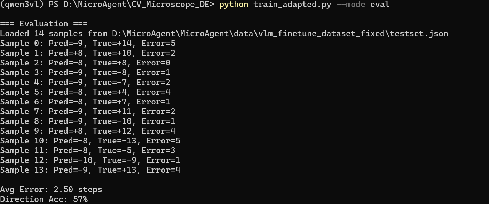
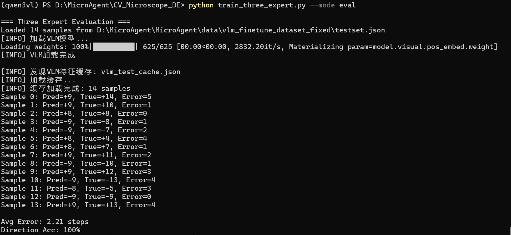

# MicroAgent 显微镜自动对焦项目

## 项目概述

显微镜自动对焦系统，基于深度学习的多专家融合方案。

## 项目结构

```
MicroAgent/
├── Qwen3-VL-2B-Instruct/      # Qwen3-VL-2B基础模型
├── Stage1/                    # VLM微调阶段
│   ├── config/               # 配置文件
│   ├── ckpt/                 # LoRA权重
│   ├── MicroAgent.py        # VLM能力展示
│   └── evaluate_finetuning_final.py
├── Stage2/                    # 三专家融合阶段
│   ├── data/                 # 数据集
│   │   └── vlm_finetune_dataset_fixed/
│   │       ├── train_only.json   # 训练集126条
│   │       ├── testset.json      # 测试集14条
│   │       └── images/           # 图片
│   ├── docs/                  # 实验结果图片
│   ├── train_adapted.py       # CNN+手工特征训练
│   ├── train_three_expert.py # 三专家融合训练
│   ├── model_adapted.pt      # CNN专家模型
│   └── three_expert_model.pt # 三专家融合模型
└── environment.yaml          # 环境配置
```

## 数据集

- **训练集**: 126条 (Stage2/data/vlm_finetune_dataset_fixed/train_only.json)
- **测试集**: 14条 (Stage2/data/vlm_finetune_dataset_fixed/testset.json)
- **图片**: Stage2/data/vlm_finetune_dataset_fixed/images/

## 实验阶段

### Stage 1: VLM微调 (Stage1)

使用LoRA微调Qwen3-VL-2B-Instruct模型。

**模型路径**:
- 基础模型: `Qwen3-VL-2B-Instruct/`(需要自行下载)
- LoRA权重: `Stage1/ckpt/checkpoint-60/`

#### 1. MicroAgent.py - VLM能力展示

VLM模型的三个能力演示：
- 纯文本对话功能
- 图文对话功能（描述图片内容）
- 显微镜对焦动作预测（双图像帧分析）

**运行结果示例**:
```bash
cd D:\MicroAgent\Stage1
conda activate qwen3vl
python MicroAgent.py config/evaluation_config.yaml
```

输出：
```
[TEST 1] Text Chat Test
[User] 显微镜使用操作流程与注意事项
[Model] Response: 显微镜是生物学、医学、材料科学等众多领域中不可或缺的重要实验工具...

[TEST 2] Image Chat Test
[Image] Path: D:\MicroAgent\Stage2\data\vlm_finetune_dataset_fixed\images\sample_0_0_0.png
[User] 请描述这张图片中金属工件是什么样的
[Model] Response: 这张图片展示了一个由金属材料制成的、具有特定几何形状和表面特征的工件...

[TEST 3] Action Prediction Test
Frame 1: sample_0_0_0.png
Frame 2: sample_0_0_1.png
[Result]: Direction: Left (-), Distance: 1 pixels
```

#### 2. evaluate_finetuning_final.py - Stage1结果量化

对微调后的VLM模型在测试集上进行评估，输出方向准确率、距离误差等量化指标。

```bash
cd D:\MicroAgent\Stage1
conda activate qwen3vl
python evaluate_finetuning_final.py config/evaluation_config.yaml
```

### Stage 2: 三专家融合 (Stage2)

将CNN专家、手工特征专家和VLM专家进行融合训练。

#### 2.1 CNN + 手工特征 (with out VLM 消融实验)


```bash
cd D:\MicroAgent\Stage2
conda activate qwen3vl
python train_adapted.py --mode train
python train_adapted.py --mode eval
```

#### 2.2 三专家融合 (CNN + 手工 + VLM)


```bash
cd D:\MicroAgent\Stage2
conda activate qwen3vl
python train_three_expert.py --mode train
python train_three_expert.py --mode eval
```

## 模型结构

### CNN专家 + 手工特征

```
输入图片 -> 3层CNN(16通道) -> Linear(16*200*200->50)
                   ↓
          手工特征(4维: entropy, log(brenner), log(variance), log(energy))
                   ↓
          拼接(50*2+8=108) -> Linear(108->40) -> Linear(40->10) -> Linear(10->2)
          输出: [distance, direction]
```

### 三专家融合

```
CNN专家: 3层CNN + Linear -> 100维 -> 32维
手工特征: 4维 x 2 = 8维 -> 32维  
VLM专家: Qwen3VL-2B + LoRA -> 2维(direction, distance) -> 32维

各专家特征归一化后拼接: 32*3=96维 -> 64 -> 32 -> 2
```


## 环境配置

```bash
# 创建环境
conda env create -f environment.yaml

# 或者激活已有环境
conda activate qwen3vl
```

## 依赖

```
torch>=2.0.0
torchvision>=0.15.0
numpy
pillow
opencv-python
transformers>=4.47.0
peft
accelerate
sentencepiece
protobuf
safetensors
huggingface-hub
scipy
matplotlib
scikit-learn
```

## 注意事项

1. VLM训练需要 `conda activate qwen3vl` 环境
2. 路径已统一到 `Stage2/data/` 目录
3. 标签提取使用正则: `"direction":\s*"([+-])"`
4. VLM特征缓存: `vlm_train_cache.json`, `vlm_test_cache.json`
